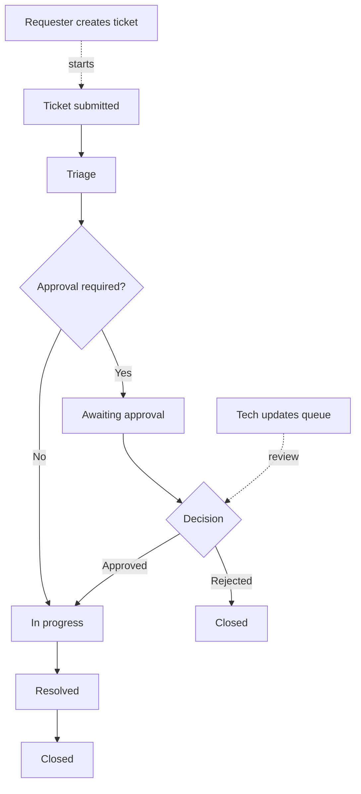
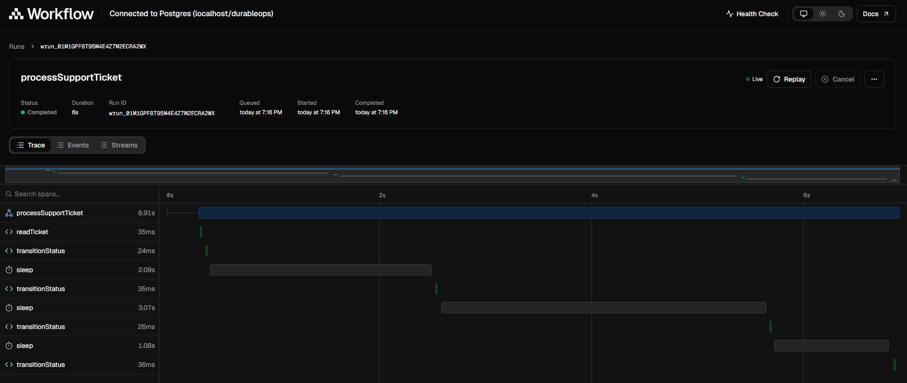

# DurableOps

DurableOps is a production-style demo application that uses Next.js 16 and Workflow SDK v5 beta to show durable orchestration with a self-hosted Postgres backend.

## Stack

- Next.js 16 (App Router + TypeScript)
- Workflow SDK v5 beta (`workflow`)
- Self-hosted Postgres world (`@workflow/world-postgres`)
- Docker Compose for local Postgres
- Human approval hook for demonstration of pause/resume
- Demo username/password authentication with scrypt password hashes and opaque, HttpOnly session cookies
- A tech account can be seeded from `TECH_USERNAME` and `TECH_PASSWORD` in `.env.local`
- Authenticated support ticket creation with requester and tech queues

## Why Workflow SDK instead of Temporal?

Temporal is a powerful, established platform for large-scale workflow orchestration. This demo uses Workflow SDK to show a serverless-friendly operating model: durable workflows can live beside the Next.js application and be deployed through the same application pipeline, without requiring a separately managed, always-running worker fleet.

This can simplify CI/CD for application teams. Workflow code, application code, and deployment versions can stay together in the same repository and release, while durable steps and hooks allow work to continue across requests, restarts, and process lifetimes. Workflow deployments can also be versioned independently from the rest of the application, so updating workflow behavior does not require taking the entire web application offline or coordinating a full application redeploy.

Temporal remains a strong choice when an organization needs its mature workflow platform, multi-language ecosystem, dedicated service operations, or extensive controls at significant scale. The trade-off is that Workflow SDK is a newer and more opinionated option, so teams should evaluate its operational maturity, language coverage, and hosting model against their requirements.

## Quick start

### Prerequisites

- Node.js and npm
- Docker with Docker Compose, with the Docker daemon running

Install dependencies once:

```bash
npm install
```

Run the complete demo setup. It starts Postgres on port `15432`, applies the application and Workflow SDK schema, seeds the demo data, and starts Next.js:

```bash
npm run start:demo
```

Open [http://localhost:3000](http://localhost:3000).

### Seeded demo accounts

`start:demo`, `demo:seed`, and `db:seed` all run `scripts/demo-seed.mjs`. The seeded accounts are:

| Role | Username | Password |
| --- | --- | --- |
| Requester | `demo-requester` | `demo-pass-123` |
| Requester | `demo-requester-2` | `demo-pass-123` |
| Tech operator | `demo-tech` | `demo-pass-123` |

The seed also adds sample tickets for `demo-requester`. See [DEMO.md](./DEMO.md) for an evaluation walkthrough.

### Reset and seed commands

```bash
npm run demo:seed   # Starts Postgres if possible, migrates, and adds missing demo users/tickets
npm run demo:clean  # Deletes Postgres tickets, users, and sessions
npm run db:reset    # Starts Postgres, migrates, bootstraps Workflow SDK, then seeds
```

The seed is intentionally non-destructive: it does not replace existing accounts or tickets. For a fresh demo, run `npm run demo:clean` before `npm run db:reset` (or before `npm run demo:seed`).

### Manual setup

1. Start Postgres:

   ```bash
   npm run db:up
   ```

2. Bootstrap the Workflow SDK tables and apply application migrations:

   ```bash
   npm run db:bootstrap
   ```

   This also applies the versioned application migrations for the ticket tables. To apply only application migrations, use `npm run db:migrate`.

3. Seed the demo users and tickets:

   ```bash
   npm run demo:seed
   ```

4. Run the app:

   ```bash
   npm run dev
   ```

5. Open http://localhost:3000 and sign in with a seeded account.

No environment file is required for the local defaults. To add a separate local tech account, create `.env.local` with `TECH_USERNAME` and `TECH_PASSWORD`. The configured tech account is created in Postgres when authentication is first used.

### Optional AI ticket advisor

The advisor is disabled by default. With no AI environment variables (or with `AI_PROVIDER` unset), tickets are submitted normally and no recommendation is generated.

To enable it, copy `.env.example` to `.env.local`, choose one provider with `AI_PROVIDER=openai` or `AI_PROVIDER=anthropic`, set the corresponding API key, and set `TICKET_ADVISOR_COMPANY_CONTEXT`. The advisor sends each newly submitted ticket and that context to the configured provider, then stores a short recommendation visible only to tech users. If the provider is unavailable, the ticket is still created and the UI reports that advice was unavailable. Keep keys in `.env.local`; do not commit them. Review advice before acting on it, and only submit ticket content that your selected provider is approved to process.

For UI-only development when Docker is unavailable, use:

```bash
npm run start:demo:offline
```

The workflow APIs still require the Postgres World to be running.

## Workflow story

This demo uses a single durable workflow to model a realistic support queue:

- The support ticket workflow moves a request through submitted -> triage -> awaiting approval when required -> in progress -> resolved -> closed.

The workflow is explicitly role-aware. Requesters only see their own tickets, while tech users see the full queue and can update any ticket state, assignee, and notes.



## Workflow trace dashboard

The Workflow SDK ships a local trace dashboard that visualizes each durable run as a timeline of steps, sleeps, and hooks, connected directly to the Postgres world:



To view it:

1. With Postgres running (`npm run db:up` or `npm run start:demo`) and at least one ticket created, start the dashboard:

   ```bash
   npm run workflow:web
   ```

2. Open the printed local URL (`http://localhost:3456` by default). It lists recent workflow runs; select `processSupportTicket` to see the run's status, duration, and a **Trace** view of every step (`readTicket`, `transitionStatus`) and `sleep` in the durable ticket lifecycle.
3. Live runs update in real time, so triggering a ticket from the app (or waiting for a `sleep` to resolve) is visible on the timeline as it happens.

This is a useful way to show the team how the ticket lifecycle actually executes as a durable workflow, including the pause at `awaiting approval`, rather than only the resulting ticket state in the UI.

## Roles and lifecycle

The demo sign-up form can create either role:

- `requester`: creates tickets and sees only their own issue history
- `tech`: sees the entire ticket queue, updates status, and resolves tickets

Ticket lifecycle states are:

- `submitted`
- `triage`
- `awaiting approval`
- `in progress`
- `resolved`
- `closed`

Sensitive, high-impact, or high-priority tickets automatically pause at `awaiting approval` and resume through a typed Workflow SDK hook. This is implemented as a durable approval gate rather than a simple UI flag, so the approved/denied decision is persisted and replay-safe.

## Evaluate the demo

1. Sign in as `demo-requester` and inspect the sample tickets, which demonstrate requester-only visibility and several lifecycle states.
2. Create a new **Sensitive**, **High-impact**, or **High** priority ticket. Refresh after a few seconds until it reaches **awaiting approval**.
3. Sign out and sign in as `demo-tech`. The operator queue shows every request.
4. Approve or reject the newly created waiting ticket. Approval resumes its durable workflow; rejection closes it. For ordinary operator actions, add a status note before changing status.

The pre-seeded tickets are display data and do not have a live workflow run attached. Use a newly created qualifying ticket to evaluate the approval hook.

## Authentication and tickets

The demo stores operational data and authentication state in Postgres. Application schema changes are tracked as versioned Drizzle migrations under `drizzle/` and are applied before the app starts:

- `durableops_users` stores demo users with `scrypt` password hashes and role metadata
- `durableops_sessions` stores hashes of opaque session tokens and their expiry time
- `durableops_tickets` stores tickets, lifecycle state, queue ownership, workflow run IDs, and optional advisor advice
- `POST /api/auth/register`, `POST /api/auth/login`, `POST /api/auth/logout`, and `GET /api/auth/me` manage sessions
- `GET /api/tickets` returns the signed-in user’s tickets for requesters or the full queue for tech
- `POST /api/tickets` creates a ticket and starts `processSupportTicket`
- `PATCH /api/tickets/[id]` lets tech update queue state and assignee metadata
- `POST /api/tickets/approve` resumes the durable approval hook for sensitive or high-impact requests

Use a managed database, a secret manager, CSRF protection, rate limiting, and a production identity provider before deploying.

## Demo features

- Role-based sign up for `requester` and `tech` users
- Durable support ticket lifecycle with per-role access control
- Tech queue and operator dashboard with required status notes
- Approval hooks for sensitive and high-impact ticket categories
- Postgres-backed ticket storage and workflow integration
- Clear separation between app users and operational ticket processing
- Postgres bootstrap script that sets Docker config and waits for `pg_isready`

## Useful commands

```bash
npm run workflow:web
npx workflow inspect runs
npm run db:up
npm run db:bootstrap
```
