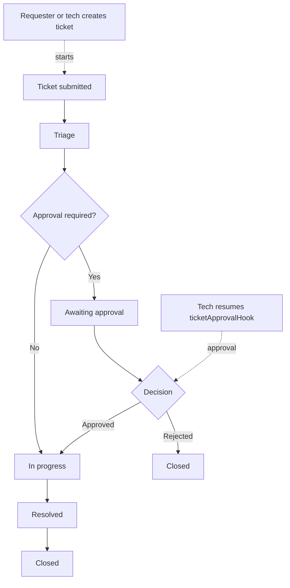

# DurableOps

DurableOps is a production-style demo application that uses Next.js 16 and Workflow SDK v5 beta to show durable orchestration with a self-hosted Postgres backend.

## Stack

- Next.js 16 (App Router + TypeScript)
- Workflow SDK v5 beta (`workflow`)
- Self-hosted Postgres world (`@workflow/world-postgres`)
- Docker Compose for local Postgres
- Human approval hook for demonstration of pause/resume
- Demo username/password authentication with scrypt password hashes and signed, HttpOnly session cookies
- A tech account can be seeded from `TECH_USERNAME` and `TECH_PASSWORD` in `.env.local`
- Authenticated support ticket creation with requester and tech queues

## Quick start

1. Start Postgres:

   ```bash
   npm run db:up
   ```

2. Set environment variables:

   ```bash
   cp .env.example .env.local
   ```

   Set `TECH_USERNAME`/`TECH_PASSWORD` in `.env.local` for the local tech account. It is created automatically the first time auth storage is read and is never exposed through public registration. If an existing account uses that username, its role is synchronized to tech.

3. Bootstrap the Workflow SDK tables:

   ```bash
   npm run db:bootstrap
   ```

4. Run the app:

   ```bash
   npm run dev
   ```

5. Open http://localhost:3000, create a user, and explore the support ticket and onboarding demos.

For UI-only development when Docker is unavailable, use:

```bash
npm run start:demo:offline
```

The workflow APIs still require the Postgres World to be running.

## Workflow story

This demo includes two durable workflows:

- The onboarding workflow validates a customer record, continues through a durable step chain, and waits for a human approval decision before finalizing.
- The support ticket workflow models a production-grade lifecycle: submitted -> triage -> awaiting approval when required -> in progress -> resolved -> closed.

The support ticket workflow is explicitly role-aware. Sensitive and high-impact work pauses for an approval hook before technical work begins, while routine requests continue directly into the tech queue.



## Roles and lifecycle

Support accounts can be created with one of two roles:

- `requester`: creates tickets and views only their own issue history
- `tech`: sees the operator queue, assigns work, and resolves tickets

Ticket lifecycle states are:

- `submitted`
- `triage`
- `awaiting approval`
- `in progress`
- `resolved`
- `closed`

Sensitive, high-impact, or high-priority tickets automatically pause at `awaiting approval` and resume through a typed Workflow SDK hook. This is implemented as a durable approval gate rather than a simple UI flag, so the approved/denied decision is persisted and replay-safe.

## Authentication and tickets

The demo intentionally uses file-backed persistence under `.durableops/` so it can run without adding a second application database:

- `auth.json` stores users with `scrypt` password hashes, opaque session cookies, and role metadata
- `tickets.json` stores tickets, lifecycle state, queue ownership, and workflow run IDs
- `POST /api/auth/register`, `POST /api/auth/login`, `POST /api/auth/logout`, and `GET /api/auth/me` manage sessions
- `GET /api/tickets` returns the signed-in user’s tickets for requesters or the full queue for tech
- `POST /api/tickets` creates a ticket and starts `processSupportTicket`
- `PATCH /api/tickets/[id]` lets tech update queue state and assignee metadata
- `POST /api/tickets/approve` resumes the durable approval hook for sensitive or high-impact requests

This persistence is suitable for local demos only. Use a managed database, a secret manager, CSRF protection, rate limiting, and a production identity provider before deploying.

## Demo features

- Durable onboarding workflow with a human approval gate
- Durable support ticket lifecycle with requesters and tech roles
- Tech queue and operator dashboard with role-aware actions
- Approval hooks for sensitive and high-impact ticket categories
- Run status + history API at `/api/runs/[runId]` and `/api/runs`
- File-backed demo history store for timeline snapshots and recent-run views
- Stronger approval UX with reviewer notes, status cards, and a run timeline
- Postgres bootstrap script that sets Docker config and waits for `pg_isready`

## Useful commands

```bash
npx workflow web
npx workflow inspect runs
npm run db:up
npm run db:bootstrap
```
